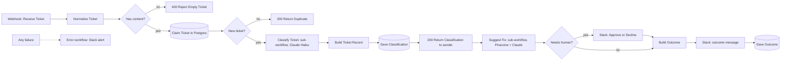

# IT Ticket Triage Agent (n8n)

A low-code agent that reads an IT support ticket, classifies it with Claude, checks for duplicates, suggests a fix from a knowledge base of SOPs (RAG), asks a human to approve anything risky, and logs every step.

Status: working prototype, built as a personal project. It runs live on an n8n cloud trial. It is not a client production system.

## What it does

1. A ticket arrives at a webhook (from a form, an email tool, or any system that can send JSON).
2. Empty tickets are rejected before any AI cost.
3. The ticket is claimed in Postgres. If the same ticket arrives twice, the second copy stops here.
4. Claude Haiku classifies it: category, priority, affected system, summary, confidence.
5. Code re-checks the model output. P1, security, low confidence, or bad output forces a human review.
6. RAG: the ticket is matched against SOPs in Pinecone, and Claude writes a short fix using only the matching SOP.
7. Tickets that need a human wait in Slack for Approve or Decline (1 hour limit).
8. The outcome is posted to Slack and saved in Postgres.
9. If the workflow fails, a separate error workflow alerts Slack.

## Diagram



## Workflows

All files are in `workflows/`. They are n8n workflow JSON and can be imported with **Import from file**.

| File | Workflow | Purpose |
|---|---|---|
| `01_it_ticket_triage_agent.json` | IT Ticket Triage Agent | Main flow |
| `02_ticket_classifier_shared.json` | Ticket Classifier (shared) | Claude classification plus validation. Called by the main flow and by the eval, so both use the same prompt |
| `03_suggest_fix_from_sops_shared.json` | Suggest Fix from SOPs (shared) | RAG: Pinecone search, score gate, grounded answer, source check |
| `04_ticket_triage_error_alerts.json` | Ticket Triage - Error Alerts | Posts failed node, error and execution link to Slack |
| `05_ticket_form_demo_intake.json` | Ticket Form (demo intake) | Web form that posts to the webhook |
| `06_sop_knowledge_base_load.json` | SOP Knowledge Base - Load into Pinecone | Embeds 10 SOPs into Pinecone |
| `07_ticket_classifier_eval.json` | Ticket Classifier - Eval (20 tickets) | Scores the classifier on 20 labelled tickets |
| `08_sop_retrieval_eval.json` | SOP Retrieval - Eval (9 tickets) | Checks the right SOP (or none) comes back |

The files hold credential names and ids only. No keys or passwords are stored in workflows; they live in the n8n credential store.

## Data flow

**Input** (POST, JSON):

```json
{ "from": "priya@acme.com", "subject": "Cannot log in", "body": "Details...", "event_id": "optional" }
```

**Dedupe key:** `event_id` if the sender gives one, otherwise a SHA-256 hash of from + subject + body. The key comes from the ticket itself, never from the run time, so a retry of the same ticket gives the same key.

**Classifier output** (fixed schema):

| Field | Values |
|---|---|
| category | access, hardware, software, network, email, security, other |
| priority | P1, P2, P3, P4 |
| affected_system | text, or "unknown" |
| summary | one sentence |
| confidence | 0 to 1 |
| needs_human | true or false |
| reasoning | one or two sentences |

**Human review is forced by code** (not left to the model) when any of these is true: priority is P1, category is security, confidence is below 0.7, the model asked for review, or the output failed validation.

**RAG output:** `suggested_fix`, `sop_source`, `sop_score`, `sop_found`.

**Postgres tables** (Supabase, see `db/schema.sql`):

- `ticket_log`: one row per ticket. `dedupe_key` is unique. Status moves `processing` → `classified` → `done`, `rejected` or `timed_out`.
- `eval_runs`: one row per classifier eval run, with scores and the list of failures.

## How the RAG step avoids made-up answers

1. **Score gate:** only SOPs with a similarity score of 0.35 or higher are passed to the model. Below that, the answer is "No matching SOP".
2. **Grounded prompt:** Claude may only use steps written in the SOP, and must answer `NO_MATCH` if none of the SOPs fit.
3. **Source check in code:** Claude must name the SOP it used. Code checks that SOP was really one of the retrieved ones. If not, the answer is thrown away.
4. **Fail-safe:** if Pinecone or the model call fails, the ticket still completes and the message says the lookup was not available.

## Reliability

| Risk | How it is handled |
|---|---|
| Same ticket sent twice | Unique `dedupe_key`. The insert returns no row for a duplicate, so the flow stops with a "duplicate" reply |
| Run crashes after claiming a ticket | A row stuck in `processing` for 15 minutes can be claimed again |
| Model or database call fails | Retries: 2 or 3 tries with a wait between them |
| Slack is down | Outcome message is set to continue on error, so the ticket still completes |
| Nobody answers the approval | Wait ends after 1 hour, outcome is saved as `timed_out` |
| Model returns a bad value | Code validation replaces it with a safe default and forces human review |
| Ticket text tries to instruct the model | Prompts treat ticket text as data. Covered by an eval case |
| Sender waits on a human | The reply to the sender is sent right after classification, before the RAG step and the Slack approval. An earlier version replied after the approval, so the sender timed out at 60 seconds and resent (caught by the duplicate check) |
| Workflow error | Error workflow posts an alert to Slack (production runs only) |

## Evaluation

**Classifier**, 20 labelled tickets, prompt version v2, Claude Haiku:

| Measure | Score |
|---|---|
| Category correct | 18 of 20 |
| Priority correct | 17 of 20 |
| Needs-human correct | 19 of 19 |
| All three correct | 15 of 20 |

All five misses were on the safe side: no risky ticket skipped human review.

**RAG retrieval**, 9 labelled tickets (7 with a matching SOP, 2 with none):

| Version | Score | Note |
|---|---|---|
| 1: top hit only, gate 0.3 | 7 of 8 | "Whole team locked out" matched the single-user lockout SOP, so the model answered NO_MATCH |
| 2: top 3 above gate 0.45, model names its source | 8 of 8 | A live P1 ticket (ERP error for everyone) then scored 0.379 and was cut by the gate. It was added to the eval as case R09 |
| Current: same, gate 0.35 | 9 of 9 | The vague ticket scores 0.387, above the gate, and is still rejected by the grounded prompt |

Run the evals after every prompt, SOP, threshold or model change.

## Dependencies

| Service | Used for | Credential in n8n |
|---|---|---|
| n8n cloud | Runs the workflows | - |
| Anthropic (Claude Haiku) | Classification, suggested fix | n8n AI gateway credits |
| OpenAI `text-embedding-3-small` | Embeddings, 512 dimensions | n8n AI gateway credits |
| Pinecone | Index `ticket-sops` (512 dimensions, cosine), namespace `sops` | Pinecone API key |
| Supabase Postgres | Dedupe and logs | Postgres, session pooler host, port 5432 |
| Slack | Alerts and approvals | Slack OAuth2 |

## Set up in a new n8n

1. Run `db/schema.sql` in a Postgres database.
2. Create a Pinecone index: 512 dimensions, cosine.
3. In n8n, add credentials for Postgres, Slack, Pinecone, Anthropic and OpenAI.
4. Import the files in `workflows/` in this order: 02, 03, 04, then 01, then the rest.
5. In 01, 07 and 08, re-point the "Execute Sub-workflow" nodes to the imported 02 and 03 (workflow ids change on import). In 01, set the error workflow to 04.
6. Pick your Slack channel in the Slack nodes.
7. Run 06 once to load the SOPs. Run 07 and 08 and check the scores.
8. Publish 02, 03, 04, then 01.

## Troubleshooting

| Symptom | Likely cause | Fix |
|---|---|---|
| Postgres: "Connection refused" | Host is `localhost` or wrong | Use the Supabase session pooler host, port 5432 |
| Postgres: "Host not found" | Typo or extra text in host | Host only. No `postgresql://`, no port, no spaces |
| Postgres: "self-signed certificate in certificate chain" | Certificate check | Turn on "Ignore SSL Issues", or add the Supabase CA certificate |
| Postgres: "Tenant or user not found" | Wrong pooler host or user | User must be `postgres.<project-ref>`. Try the other pooler host (`aws-0` or `aws-1`) |
| Pinecone: "Vector dimension 1536 does not match the dimension of the index 512" | Embedding size and index size differ | Set the same dimensions in both Embeddings nodes as the index |
| "Node does not have any credentials set" | Credential not attached to the node | Open the node and pick the credential |
| Slack: "channel_not_found" | Channel missing or app not in it | Create the channel, or invite the n8n app to it |
| Reply says "duplicate" | Same ticket was already processed | Expected. Change the ticket text or send a new `event_id` |
| Approval buttons do nothing | The 1 hour wait has ended | Send the ticket again |
| Suggested fix says "No matching SOP" for a known problem | Score under the gate, or SOPs not loaded | Run 08 to see scores. Rerun 06 |
| No Slack alert on failure | Manual test runs do not fire the error workflow | Test with a production run |
| Cannot set the error workflow | The error workflow is not published | Publish it first |

Where to look first: n8n **Executions** list, open the failed run, click the red node.

## Rollback

1. **Stop intake:** unpublish "IT Ticket Triage Agent". The webhook stops accepting tickets.
2. **Go back a version:** open the workflow, open **Version history**, pick the last good version, restore it, then publish. Or import the JSON from an earlier commit of this repo.
3. **Prompt rollback:** the classifier prompt lives only in 02 and the RAG prompt only in 03. Restore the earlier version, publish, then run the matching eval and confirm the score.
4. **Knowledge base rollback:** restore 06 to the earlier SOP text and run it. It clears the namespace before loading.
5. **Data:** rows written by a bad version carry its `prompt_version`. Review with:
   ```sql
   select * from ticket_log where prompt_version = 'v2' and created_at > '2026-10-08';
   ```
6. **Re-process a ticket:** delete its row from `ticket_log` and send it again.

## Known limits

- The webhook and the demo form have no authentication. Before real use, add header auth or a signed secret.
- "Ignore SSL Issues" is on for the Postgres credential. For real use, add the Supabase CA certificate.
- No ticketing system is connected yet. ServiceNow was planned and left out.
- The approval step does not record who clicked.
- The knowledge base is 10 short SOPs written for this project.
- Tested with a few dozen tickets, not at volume. Rate limits were not reached.
- The workflow JSON in this repo was exported by reading each workflow definition from n8n and was checked for valid JSON and matching node names. For a byte-exact copy, use **Download** in the n8n workflow menu.
